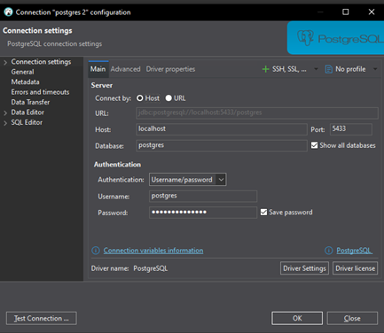
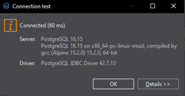

# 🛠 Настройка окружения: Docker + PostgreSQL + DBeaver (Для Windows 10)

  

Данная инструкция описывает пошаговый процесс подготовки локального окружения для разработки.

  

## 📋 Предварительные требования

  

1. Скачайте и установите [Docker Desktop](https://docs.docker.com/desktop/setup/install/windows-install/) (Docker Desktop for Windows - x86_64).

2. Перезагрузите компьютер после установки.

  

---

  

## 🐳 Шаг 1: Установка PostgreSQL в Docker

  

1. Откройте **PowerShell** и скачайте официальный образ PostgreSQL:

  

```powershell

docker pull postgres:16-alpine

```

  
  

2. Убедитесь, что образ успешно скачался:

```powershell

docker images

```

  

> 💡 Почему именно версия alpine?

> Alpine — это минималистичный Linux-дистрибутив, который идеально подходит для локальной разработки:

>  * Размер (главная причина): postgres:16-alpine весит ~50-100 MB, тогда как обычный postgres:16 — ~300-400 MB.

>  * Безопасность: Меньше пакетов = меньше потенциальных уязвимостей. Alpine создан с фокусом на безопасность.

>  * Производительность: Потребляет меньше ресурсов и быстрее запускается.

>  * Для разработки: Внутри контейнера не нужны лишние инструменты, так как подключение к БД происходит снаружи (через DBeaver/pgAdmin).

  
  

3. Создайте и запустите новый контейнер:

```powershell

docker run --name taskflow-db `
-e POSTGRES_USER=postgres `
-e POSTGRES_PASSWORD=StrongP@ssw0rdHere `
-e POSTGRES_DB=TaskFlow `
-e TZ=Europe/Moscow `
-p 5433:5432 `
-v taskflow_data:/var/lib/postgresql/data `
-d postgres:16-alpine

```

  

4. Проверьте, что контейнер успешно запущен:

```powershell

docker ps

```

Ожидаемый результат:

  


  
  

## ⚠️ Шаг 2: Решение возможных проблем с запуском Docker

ВАЖНО! Если после перезагрузки компьютера Docker не стартует или долго висит в статусе Docker Desktop is starting..., выполните следующие действия:

1. Полностью закройте Docker Desktop.

2. Нажмите Win + Q и введите в поиске: Безопасность Windows.

3. В левом меню выберите Управление приложениями и браузером.

4. Внизу страницы нажмите на ссылку Защита от эксплойтов.

5. Перейдите на вкладку Параметры программ.

6. Найдите в списке C:\Windows\System32\VmCompute.exe и нажмите кнопку [Изменить].

7. Найдите блок `Защита потока управления (CFG)` и снимите галочку ✔ с главного пункта "Переопределить системные параметры".


8. Сохраните изменения и запустите Docker Desktop заново.

  

## 💻 Шаг 3: Установка и настройка DBeaver

1. Скачайте DBeaver Community с официального сайта [DBeaver Community](https://dbeaver.io/download/) (Download EXE).


2. Установите программу и перезагрузите компьютер (если потребуется).

3. Запустите DBeaver. На верхней панели выберите: База данных → Новое соединение (или нажмите Ctrl + Shift + N).


4. В открывшемся окне выберите PostgreSQL и нажмите [Далее].


5. Настройте параметры подключения к нашей базе данных:
> * **Хост (Host):** localhost
> * **Порт (Port):** 5433
> * **База данных (Database):** TaskFlow (или postgres для первичного входа)
> * **Имя пользователя (Username):** postgres
> * **Пароль (Password):** StrongP@ssw0rdHere



6. Нажмите кнопку **[Test Connection...]**. Вы должны получить сообщение об успешном подключении:



  


## 🗄️ Шаг 4: Создание схемы базы данных (Database First)

Поскольку мы используем подход **Database First**, сначала мы создаем структуру таблиц в PostgreSQL, а затем сгенерируем C#-классы с помощью EF Core.

1. Откройте **DBeaver**, подключитесь к базе данных `TaskFlow` (порт `5433`).
2. Создайте новый SQL-скрипт (`Ctrl + ]` или правая кнопка мыши по соединению → SQL Editor → New SQL Script).
3. Выполните следующий скрипт для создания таблиц пользователей и токенов: